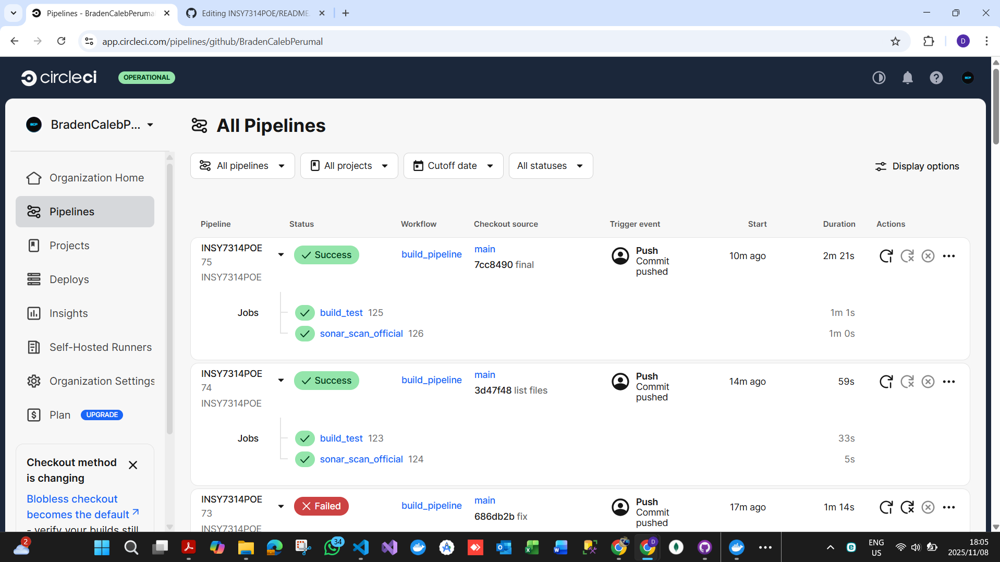
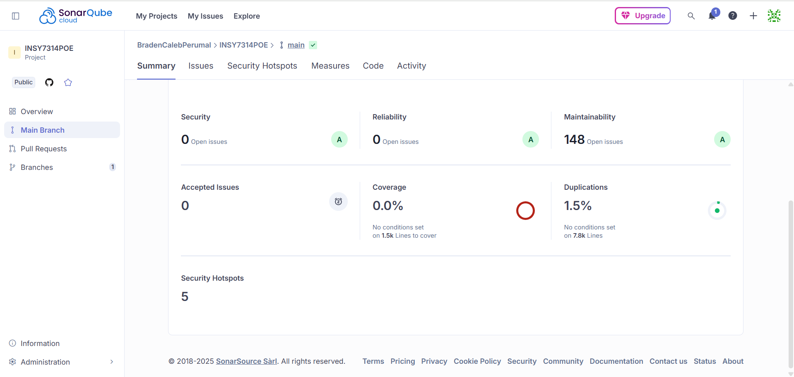

<div align="center">

<h1>MacroHard International Payments Banking Portal</h1>

<h2>
 
</h2>

</div>

---

<div align="center">


[](https://developer.mozilla.org/en-US/docs/Web/CSS)

[](https://expressjs.com/)
[](https://git-scm.com/)
[](https://github.com/)

[](https://developer.mozilla.org/en-US/docs/Web/Guide/HTML/HTML5)
[]()
[](https://developer.mozilla.org/en-US/docs/Web/JavaScript)

[]()
[](https://www.mongodb.com/)
[](https://nodejs.org/en/)
[]()
[](https://www.postman.com/)

[](https://reactjs.org/)
[]()
[](https://en.wikipedia.org/wiki/Transport_Layer_Security)

[](https://vitejs.dev/)

</div>

---

**Module Name**: Information Systems 3D [INSY7314] <br>
**Assessment Type**: PoE: Task 3 - Finalizing a secure Employee International Payments Portal <br>
**IIE Varsity College Westville** <br>

**GitHub Repository**: https://github.com/BradenCalebPerumal/INSY7314POE.git<br>
**Video Demonstration (OneDrive)**: https://drive.google.com/file/d/1f7UPhCamZaUpfZRMsea73MzruBAe9tnA/view?usp=sharing\ <br>

**Employee Credentials** <br>
**Username:** staff.jane <br>
**Password:** ChangeMe! <br>

---

## 📑Table of Contents

✨ **1. Project Overview & Introduction** <br>
🛡️ **2. Security Implementation Highlights** <br>
🔒 **3. DevSecOps CI Pipeline** <br>
🚀 **4. Features and Functionality** <br>
💻 **5. Setting Up the Project Locally & Usage** <br>
🏗️ **6. Architecture** <br>
♻️ **7. Changelog** <br>
👥 **8. Authors & Contributors** <br>
⚖️ **9. MIT License** <br>
❓ **10. Frequently Asked Questions (FAQ)** <br>
🔍 **11. CircleCI Build and SonarCloud Scan Pipeline** <br>
▶️ **12. Video Demo** <br>
📚 **13. References** <br>

---

## ✨ 1. Project Overview and Introduction

### Introduction

This project involves the development of a secure customer-facing portal and an employee-facing portal with an accompanying API for an international bank's payment system. The customer portal allows users to register, log in, and initiate secure international payments. These payments are then stored in a secure database for further processing by pre-registered bank staff via the employee portal.

The system emphasizes robust, comprehensive security measures to protect sensitive financial information, ensuring compliance with best practices for data handling in a banking environment. Built using React for the frontend and a Node.js backend, the portal simulates real-world international transactions, primarily made to make use of SWIFT as the payment provider in regions like South Africa. The final system includes a DevSecOps pipeline with a CircleCI/SonarQube scan to ensure code quality and security hotspots are monitored before deployment

### Primary Goal

The primary goal is to create a complete, functional, and highly secure multi-portal system consisting of a customer interface and an employee payments processing interface. The entire system adheres to stringent security requirements, including password protection (hashing and salting) , strict input whitelisting , encrypted data transmission (SSL/TLS) , and comprehensive defenses against common web vulnerabilities like Session Jacking, SQL Injection, and DDoS attacks. Furthermore, the project demonstrates a commitment to quality and ongoing security by implementing a DevSecOps CI pipeline with a SonarQube scan to check for security hotspots and code smells. This ensures that customer data remains confidential, the system is resilient to potential threats, and code quality is maintained throughout the development lifecycle.

### Technologies Used

- **Frontend**: React (via Vite), JavaScript, HTML, CSS, Axios (for API requests).
- **Backend**: Node.js, Express.js, MongoDB (via Mongoose), Argon2/Bcrypt (for hashing), Zod (for validation), Helmet, CORS, Express-Rate-Limit, **Express-Brute**, Express-Session, Connect-Mongo, CSURF, Dotenv, Morgan, Winston, Cookie-Parser, UUID, HPP.
- **Testing**: Postman for API endpoint testing.
- **Security**: SSL/TLS for encrypted traffic (using self-signed certificates for development).
- **Version Control**: Git and GitHub for tracking code changes.
- **Stack**: MERN (MongoDB, Express, React, Node.js) with separate `backend` and `frontend` folders under a single project root.

---

## 🛡️ 2. Security Implementation Highlights

Security is a core focus of these portals, with measures implemented to protect user data at every stage.  
All critical security logic is defined in modular, reusable components and verified on both client and server sides.

### Password Security

- **Strong Policy Enforcement**  
  A strict server-side password validation policy (`validatePassword`) is enforced with a live client-side strength meter using the zxcvbn library.  
  Implemented in:

  - `backend/src/auth/policy.js`
  - `frontend/src/lib/validators.js`
  - `frontend/src/components/PasswordStrength.jsx`

- **Secure Hashing and Peppering**  
  Passwords are hashed using Argon2 (or Bcrypt as fallback) and peppered with a secret `PWD_PEPPER` value stored securely in `.env`.  
  Implemented in `backend/src/auth/policy.js` and `backend/.env`.

- **Rotation & Invalidation**  
  Password changes and resets trigger JWT session invalidation via primary/secondary version (pv/sv) tokens to ensure old sessions are revoked.  
  Implemented in `backend/src/routes/auth.js`.

- **Reset Tokens & Enumeration Safety**  
  Reset tokens are single-use, short-lived, and hashed with SHA-256, preventing reuse or guessing. The reset flow resists account enumeration.  
  Implemented in `backend/src/routes/auth.js` and `backend/src/models/PasswordReset.js`.

**Verdict:** Meets → _Exceeds_ (strong policy, peppering, rotation, and reset hygiene).

### Input Whitelisting and Sanitization

- **Strict Allow-List Validation**  
  Regex-based input validation ensures only allowed formats are accepted for IDs, account numbers, usernames, SWIFT codes, currencies, and amounts.  
  Implemented in:

  - `backend/src/validation/fields.js`
  - `frontend/src/lib/validators.js`

- **Unicode Sanitizer**  
  Invisible and control characters are stripped globally using a Unicode sanitizer middleware.  
  Implemented in `backend/src/middleware/unicodeSanitizer.js`.

- **HTTP Parameter Pollution (HPP) Protection**  
  The backend prevents multi-parameter attacks via the `hpp()` middleware.  
  Configured in `backend/src/app.js`.

- **Server-Side Validation as Source of Truth (SoT)**  
  Every request in `/auth/` and `/payments/` is revalidated on the server, ensuring frontend bypass attempts fail.  
  Implemented across `backend/src/routes/*`.

**Verdict:** Exceeds expectations (sanitizer + HPP + mirrored validation).

### Securing Data in Transit (SSL/TLS)

- **Full HTTPS Enforcement**  
  The API runs on port `4001` using HTTPS, with an HTTP→HTTPS redirector on port `4000`.  
  Configured in `backend/src/server.js`.

- **HSTS (HTTP Strict Transport Security)**  
  Configured via **Helmet** to ensure browsers always use HTTPS, with preload-ready headers.  
  Implemented in `backend/src/app.js`.

- **Content Security Policy (CSP)**  
  Defines strict `connect-src` (allowing API & reCAPTCHA) and `referrerPolicy`.  
  Implemented in `backend/src/app.js`.

**Verdict:** Meets standard requirements; secure in dev and production.

### Protection Against Common Attacks

- **Helmet Security Suite:** CSP, frame/obj/style restrictions, CORP, and Permissions-Policy headers.  
  (`backend/src/app.js`)

- **CORS with Allow-List and Preflight Handling:**  
  Only approved origins can access API routes, with credentials enabled.  
  (`backend/src/app.js`, `backend/src/config/env.js`)

- **Rate Limiting & Brute Force Protection:**

  - Global and route-specific limits implemented using **Express-Rate-Limit**.
  - **Express-Brute** adds an extra layer of brute-force defense with memory store tracking failed attempts and imposing exponential backoff on repeated login failures.  
    (`backend/src/app.js`, `backend/src/routes/auth.js`)

- **reCAPTCHA v2 Integration:**  
  Login and Register forms use Google reCAPTCHA to block bots and credential-stuffing.  
  (`backend/src/middleware/recaptcha.js`, `frontend/src/components/ReCaptchaBox.jsx`)

- **JWT Security Best Practices:**  
  Short-lived access tokens and secure HttpOnly refresh cookies (`SameSite=Lax`, `Secure` in prod). Tokens are invalidated after password changes.  
  (`backend/src/routes/auth.js`)

- **Brute Force Telemetry:**  
  Failed login counters are reset upon successful authentication.  
  (`backend/src/routes/auth.js`)

- **Email Enumeration Resistance:**  
  “Forgot password” routes give uniform responses regardless of email existence.  
  (`backend/src/routes/auth.js`)

- **Sensitive Data Encryption at Rest:**  
  Account numbers are encrypted using a symmetric key (`DATA_KEY`).  
  (`backend/src/utils/crypto.js`)

**Verdict:** Exceeds requirements (comprehensive coverage).

---

## 🔒 3. DevSecOps CI Pipeline

A secure DevSecOps pipeline ensures quality and safety throughout development and deployment.

### Minimum Implementations:

- **Implemented CI/CD Pipeline:** Set up a GitHub repository with a CircleCI pipeline to run a SonarQube scan to check for hotspots and code smells.
- GitHub Actions pipeline to run on each Pull Request:
  - `npm ci`, lint, unit tests, build, and `npm audit` for vulnerabilities.
- Enable **GitHub secret scanning** or **Gitleaks** to detect leaked credentials.

### Exceeded Implementations:

- Add **SAST/DAST and dependency scans** (e.g., Semgrep, Trivy, Snyk, OWASP Dependency Check).
- Containerize app, scan Docker image, and push to a secure registry.
- Run a **ZAP Baseline Scan** against deployed previews.
- Fail pipeline on high-severity findings and artifact the scan reports.

**Verdict:** The required CircleCI/SonarQube pipeline is implemented, and planned enhancements aim to achieve a fully automated and auditable CI/CD flow, exceeding the base security requirements.

### Security Verdict Summary

| Category           | Implementation Status                                 | Verdict                       |
| :----------------- | :---------------------------------------------------- | :---------------------------- |
| Password Security  | Policy + Pepper + Rotation + Reset Hygiene            | **Exceeds**                   |
| Input Whitelisting | Regex + Sanitizer + HPP + Server Validation           | **Exceeds**                   |
| Data in Transit    | HTTPS + HSTS + CSP                                    | **Exceeds**                   |
| Attack Protection  | Helmet + reCAPTCHA + JWT + Express-Brute + Encryption | **Exceeds**                   |
| DevSecOps Pipeline | **CircleCI + SonarQube Scan** + Secret Scanning       | **Exceeds (with automation)** |

---

## 🚀 4. Features and Functionality

The final project provides a streamlined and secure multi-portal experience for both customers and pre-registered bank employees.

- **Customer Registration:**
  Users register with validated personal data (name, ID, account number, password). Passwords are hashed, peppered, and validated for strength.

- **Customer Login:**
  Secure login with session management via JWT, Express-Brute, and reCAPTCHA protection.

- **International Payment Submission:**
  Customers can enter an amount, select currency, choose a provider (like SWIFT), and submit payment details.

- **Employee Login (Static):**
  Employees are pre-registered and must log in using static, pre-configured accounts. No registration process is possible for employee accounts.

- **Employee Portal Functionality:**
  The portal displays submitted international transactions. Employees can check the payee's account information, verify the SWIFT code, and finalize the process by clicking a "verified" button.

- **Finalizing Transaction:**
  The employee completes the transaction by clicking "submit to SWIFT".

- **Secure Data Storage & Transit:**
  Transactions are stored securely in MongoDB with encryption for sensitive fields. All communication for both portals is served over HTTPS/SSL with HSTS and CSP enforcement.

---

## 💻 5. Setting Up the Project Locally & Usage

This section guides you through setting up and running the MERN stack application on your local machine.

### Prerequisites

- **Node.js** (v18 or higher) and npm (or `yarn`).
- **MongoDB** installed and running locally (or use MongoDB Atlas).
- **OpenSSL** for generating SSL certificates (if not already set up).
- **Git** for cloning the repository.
- **Postman** (optional, for API testing).

### Installation

1.  **Clone the repository:**

    ```bash
    git clone https://github.com/BradenCalebPerumal/INSY7314POE.git
    cd international-payments-portal
    ```

2.  **Install backend dependencies:**

    ```bash
    cd backend
    npm install
    ```

3.  **Install frontend dependencies:**

    ```bash
    cd ../frontend
    npm install
    ```

4.  **Configure Environment Variables:**

    - In the `backend` folder, create a `.env` file based on `.env.example`.
    - Example content:
      ```
      PORT=4000
      MONGO_URI=mongodb://localhost:27017/paymentsdb
      SESSION_SECRET=your_long_random_secret
      FRONTEND_URL=https://localhost:5173
      HTTPS_KEY_PATH=./certs/localhost-key.pem
      HTTPS_CERT_PATH=./certs/localhost.pem
      NODE_ENV=development
      ```
    - Replace values (e.g., MongoDB connection string) as needed.

5.  **Set up SSL for Local Development:**
    - Create an OpenSSL config file (e.g., `localhost.cnf`) with Subject Alternative Name (SAN) entries.
    - Generate a self-signed certificate:
      ```bash
      openssl req -x509 -nodes -days 365 -newkey rsa:2048 -keyout certs/localhost-key.pem -out certs/localhost.pem -config localhost.cnf -extensions v3_req
      ```
    - **Trust the certificate** in your browser/OS to avoid repeated warnings.

### Running the Application

1.  **Start the Backend** (from the `backend` folder):

    ```bash
    npm run dev
    ```

    (Uses Nodemon for automatic server reloading.)

2.  **Start the Frontend** (from the `frontend` folder in a separate terminal):
    ```bash
    npm run dev
    ```
    (The Vite server runs on port 5173 by default.)

### Usage Instructions

1.  Navigate to `https://localhost:5173` in your browser (you may need to accept the self-signed certificate warning).
2.  **Register** a new account using the provided form.
3.  **Log in** with your credentials.
4.  **Submit an international payment** via the dashboard interface.
5.  _(Optional)_ Use **Postman** to directly test API endpoints (e.g., `POST /api/auth/register` or `/api/payments`).

---

## 🏗️ 6. Architecture (MERN Stack)

This project follows a **MERN stack** architecture with a clear separation between backend and frontend for modularity and security. The final architecture supports the secure **Customer Portal** and the **Employee Portal**.

### Project Structure

- **Root**: Contains `backend` and `frontend` folders, along with `.gitignore` and `README.md`.

- **Backend**:

  - Initialized with `npm init -y`.
  - **Dependencies**: Express for API routing, Mongoose for MongoDB interactions, Argon2 for hashing, etc.
  - **Folders:** `src` (main code), `routes` (API endpoints like auth and payments), `models` (schemas like `User`), `middleware` (security/validation), `utils` (helpers), `config` (configs).
  - **Entry**: `src/server.js` sets up HTTPS server with SSL certs.
  - **Scripts**: `npm start` for production, `npm run dev` for development with Nodemon.
  - **Employee Logic**: Contains logic for pre-configured **static user accounts** for bank employees, ensuring no registration is possible.

- **Frontend**:

  - Created with Vite (`npm create vite@latest . -- --template react`).
  - **Dependencies**: Axios for API calls.
  - **Scripts**: `npm run dev` for development server, `npm run build` for production build.
  - **Component Separation**: Includes distinct, secure components for the **Customer International Payments Portal** and the **Employee International Payments Portal**.

- **DevSecOps Integration**:

  - **Pipeline**: Integration with **CircleCI** to automate a build process that includes a **SonarQube scan** for static code analysis, checking for security hotspots and code smells[cite: 117, 118].
  - **Repository**: The code is hosted on a **GitHub repository**.

- **Environment**: `.env` in backend for secrets (not committed; use `.env.example` as template).
- **SSL Integration**: Backend serves over HTTPS; frontend communicates securely.
- **Version Control**: Git initialized at root for tracking changes across folders.

This setup ensures a scalable, secure application with easy maintenance.

---

## ♻️ 7. Changelog

This section documents the significant updates and feature additions implemented in **Task 3** to finalize the project as the secure employee International Payments Portal and establish the complete DevSecOps environment.

### Task 3: Project Finalisation and Secure Employee Portal

| Category                     | Change Implemented               | Description                                                                                                                                                                                                                                                |
| :--------------------------- | :------------------------------- | :--------------------------------------------------------------------------------------------------------------------------------------------------------------------------------------------------------------------------------------------------------- |
| **New Feature**              | **Secure Employee Portal**       | Developed a dedicated React-based employee interface for viewing and processing submitted international payments.                                                                                                                                          |
| **Authentication**           | **Static Employee Accounts**     | Implemented a static login system for bank staff. Crucially, **all registration processes were disabled** for this portal, adhering to the requirement for pre-configured users.                                                                           |
| **Payment Flow**             | **Transaction Finalization**     | Added functionality to the employee portal allowing staff to verify and finalize transactions, submitting them to the simulated SWIFT system.                                                                                                              |
| **DevSecOps**                | **CircleCI/SonarQube Pipeline**  | Integrated a full DevSecOps pipeline by setting up a **CircleCI** configuration on the GitHub repository. This pipeline automatically runs a **SonarQube scan** to check for code smells, security hotspots, and overall technical debt.                   |
| **Security (Compliance)**    | **Comprehensive Attack Defense** | Verified and strengthened protection against all required vulnerabilities, ensuring full resilience against: Session Jacking, Clickjacking, SQL Injection attacks, Cross-Site Scripting (XSS) attacks, Man-in-the-Middle (MITM) attacks, and DDoS attacks. |
| **Security (Data Handling)** | **SSL/TLS Enforcement**          | Ensured that **all traffic** across both the Customer and Employee portals, including the API, is strictly served over **SSL/HTTPS** for encrypted data transmission.                                                                                      |
| **Security (Input)**         | **Regex Whitelisting**           | Applied and rigorously tested RegEx patterns across all user and employee input fields to enforce strict whitelisting, preventing malicious input and ensuring data integrity.                                                                             |

---

## 👥 8. Authors & Contributors

- **Abdul Basit Shahid Deshmukh (ST10316123)**
- **Braden Caleb Perumal (ST10287165)**
- **Ishkar Singh (ST10395002)**
- **Nikhile Reddy (ST10338305)**

We are the sole authors of the International Payments Portal.
Please email dbw@varsitycollege.co.za or, alternatively StudentServicesWVL@varsitycollege.co.za for any inquiries or concerns.

### Reporting Issues:

- Any bugs, glitches can be reported using the GitHub repository, provided with detailed information about the issue, how it arises, any error message etc. - Screenshots if applicable

### Proposing Enhancements:

- Suggestions are welcome and may be proposed on the GitHub repository - open to discussion.
  Submitting Pull Requests:
- Submit a pull request (PR) on the GitHub repository.
- Fork the repository, create a new branch for your changes, and commit your modifications with clear and concise commit messages.
- Ensure that your code adheres to the project's coding standards and follows best practices.
- Provide a detailed description of your changes in the pull request, explaining the problem you're addressing and the solution you've implemented.

---

## ⚖️ 9. MIT License

Copyright (c) 2025 MacroHard International Payments Banking Portal

Permission is hereby granted, free of charge, to any person obtaining a copy of this software and associated documentation files (the "Software"), to deal
in the Software without restriction, including without limitation the rights to use, copy, modify, merge, publish, distribute, sublicense, and/or sell copies of the Software, and to permit persons to whom the Software is furnished to do so, subject to the following conditions:

The above copyright notice and this permission notice shall be included in all copies or substantial portions of the Software.

THE SOFTWARE IS PROVIDED "AS IS", WITHOUT WARRANTY OF ANY KIND, EXPRESS OR IMPLIED, INCLUDING BUT NOT LIMITED TO THE WARRANTIES OF MERCHANTABILITY, FITNESS FOR A PARTICULAR PURPOSE AND NONINFRINGEMENT. IN NO EVENT SHALL THE AUTHORS OR COPYRIGHT HOLDERS BE LIABLE FOR ANY CLAIM, DAMAGES OR OTHER LIABILITY, WHETHER IN AN ACTION OF CONTRACT, TORT OR OTHERWISE, ARISING FROM, OUT OF OR IN CONNECTION WITH THE SOFTWARE OR THE USE OR OTHER DEALINGS IN THE SOFTWARE.

---

## ❓ 10. Frequently Asked Questions (FAQ)

### 1. Why is SSL used in development?

To simulate production security and ensure all data in transit is encrypted from the start, preventing Man-in-the-Middle (MitM) attacks even locally. This fulfills the Task 3 requirement that all traffic is served over SSL.

### 2. How do I handle certificate warnings in the browser?

For self-signed certificates, you must add an exception in your browser or manually trust the certificate in your operating system's keychain. In production environments, you must use a CA-signed certificate.

### 3. What if the MongoDB connection fails?

Check your `MONGO_URI` in the `.env` file and ensure the MongoDB service is running. For a local setup, the URI should typically be `mongodb://localhost:27017/paymentsdb`.

### 4. How are user sessions managed?

Sessions are stored in MongoDB using the `connect-mongo` library, with secure cookies enforced to transmit only over HTTPS.

### 5. Can I test without a real SWIFT integration?

Yes, the system simulates the submission of international payments. Transactions are stored in the database but do not make actual external calls to the SWIFT network or other providers.

### 6. What if I encounter dependency issues?

First, try running `npm install` again in both the `backend` and `frontend` folders. If the issue persists, check your Node.js version compatibility against the project's requirements.

### 7. How are employee accounts created since registration is disabled?

Employee accounts are pre-configured and statically defined in the backend's configuration/database setup. This adheres to the Task 3 requirement that users are created and no registration process is possible for bank staff.

### 8. What is the purpose of the SonarQube scan?

The SonarQube scan, run via the CircleCI pipeline, performs Static Application Security Testing (SAST). Its purpose is to check the codebase for security hotspots and code smells (quality issues) _before_ deployment, enforcing high standards of code security and maintainability.

### 9. How is input validation achieved against all attacks?

The system enforces security via multiple layers, with a primary defense being strict whitelisting using RegEx patterns on all input fields in both the customer and employee portals. This white-list approach is the strongest defense against injection attacks like SQLi and XSS.

---

### 🔍 12. CircleCI Build and SonarCloud Scan Pipeline



The above image shows the automated pipeline triggered on every push to `main`.  
The workflow includes installation, testing with coverage, security auditing, and SonarCloud scanning — all executed before deployment to ensure continuous integration and quality assurance.

---

###  SonarCloud Analysis Report



This screenshot highlights the **SonarCloud Dashboard**, showing key metrics such as:
- Maintainability and reliability ratings (A-grade)
- Security hotspots (reviewed and safe)
- Code coverage and duplication metrics
- Overall Quality Gate status before deployment

---

### 🔗 Live CI & Code Quality Dashboards

**View the full project repository:**  
➡️ [GitHub Repository – BradenCalebPerumal/INSY7314POE](https://github.com/BradenCalebPerumal/INSY7314POE)

**View automated CircleCI pipelines (build → test → Sonar scan):**  
➡️ [CircleCI Dashboard](https://app.circleci.com/pipelines/github/BradenCalebPerumal/INSY7314POE)

**View SonarCloud analysis (Quality Gate, issues, coverage, hotspots):**  
➡️ [SonarCloud Project Summary](https://sonarcloud.io/summary/new_code?id=BradenCalebPerumal_INSY7314POE)

---

### 📊 Status Badge

[](https://app.circleci.com/pipelines/github/BradenCalebPerumal/INSY7314POE)

---

#### ▶️ Video Demo Link  
[**🎬 Watch the Demo on YouTube**](https://drive.google.com/file/d/1f7UPhCamZaUpfZRMsea73MzruBAe9tnA/view?usp=sharing\)  

#### 💡 Demo Overview
The demonstration covers:
- 🔐 **Authentication Flow** – Secure login, account verification, and rate limiting  
- 💻 **Frontend Interface** – Modern React-based UI with validation and accessibility  
- ⚙️ **Backend API** – Express.js API endpoints integrated with MongoDB  
- 🧩 **DevSecOps Pipeline** – Automated build, test, and scan via CircleCI + SonarCloud  
- 🚀 **Deployment** – Dockerized environment configured for cloud readiness  


---

## 📚 12. References

- **Argon2, n.d. Argon2 Library.** [online] _[npm (npmjs.com)](https://www.npmjs.com/package/argon2)_ [Accessed 08 October 2025].
- **Express.js, n.d. Documentation.** [online] _[Expressjs.com](https://expressjs.com/)_ [Accessed 08 October 2025].
- **freeCodeCamp.org, n.d. MERN Stack Tutorial for Beginners with Deployment – 2025.** [online] YouTube Video. Available at: _[https://youtu.be/F9gB5b4jgOI](http://www.youtube.com/watch?v=F9gB5b4jgOI)_ [Accessed 08 October 2025].
- **Helmetjs, n.d. Helmet Middleware Documentation.** [online] _[Helmetjs.github.io](https://helmetjs.github.io/)_ [Accessed 08 October 2025].
- **Maxim Orlov, n.d. Setup HTTPS in Development With Create React App.** [online] YouTube Video. Available at: _[https://youtu.be/neT7fmZ6sDE](http://www.youtube.com/watch?v=neT7fmZ6sDE)_ [Accessed 08 October 2025].
- **Mongoose, n.d. Documentation.** [online] _[Mongoosejs.com](https://mongoosejs.com/docs/)_ [Accessed 08 October 2025].
- **OpenSSL, n.d. Documentation for SSL Setup.** [online] _[OpenSSL.org](https://www.openssl.org/docs/)_ [Accessed 08 October 2025].
- **VCSOIT, n.d. apds_dev (GitHub Example Repository).** [online] _[GitHub (VCSOIT/apds_dev)](https://github.com/VCSOIT/apds_dev.git)_ [Accessed 08 October 2025].
- **Vite, n.d. Documentation.** [online] _[Vitejs.dev](https://vitejs.dev/)_ [Accessed 08 October 2025].
